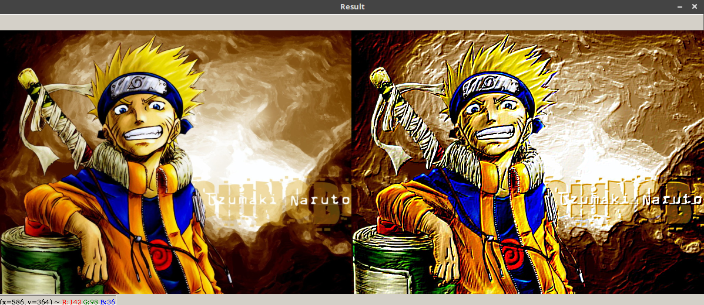

# Opencv-Python-Computer-Vision

### Color-Based-CBIR-System

##### Steps taken to implement a CBIR system:
1. Define your image descriptor and create imagebase for training.
2. Train your imagebase over the defined descriptor and save feature vector.
3. Create a search file to search/rank the images when tested against query.
4. Create testing file to test against saved feature vector for imagebase.

This folder includes files:
- featureVector.py
This file contains code for color histogram feature extraction, that return a numpy vector.
- training.py
This file trains imagebase over our featureVector and save the output in **trainingdata.pickle**.
- search.py
This file is used with testing where it helps in searching/matching featureVectors for test images and trained images.
- testing.py
This file is used for testing our system.

### 4 Point Perspective Transform

##### Steps to find the maximum sized 4 point image (considering only (possibility) rectangle):
1. Find edges of the image using canny edge detection.
2. Supply the edges to the countour function to find all possible contours.
3. Sort these countours (coordinates) in non-increasing fashion.
4. Check for 4 point countour, from the start of the returned list of countours.
5. Pass these 4 points to transform function.

##### Steps involved:
1. First of all take image and 4 points you need to transform over a perspective space.
2. Order those points in following fashion [top-left, top-right, bottom-right, bottom-left] using basic coordinate math.
3. Calculate the maxWidth and maxHeight for the perspective window, to fit the 4 point image.
4. Calculate perspective matrix (3x3) over given image and points.
5. Wrap the perspective over the perspective window.

### Video Read/Write

This file contains code for how to read/capture video from webcam, and then how to save it in (avi) extension (most stable using opencv). It uses _VideoCapture_ and _VideoWriter_ classes to perform these operation.

### Screenshot

This file implements PyAutoGUI functionality to capture screenshot whenever this program runs. It saves the result in the current folder.

### Paint Application

This app implements only paint brush operation. It uses _createTrackbar_ and _getTrackbarPos_ methods available in opencv3 to adjust colors and size of paint brush. It uses _setMouseCallback_ to allow mouse events to happen.

### Opencv Symbol Drawing

It shows code on how to make use of drawing functions in opencv to achieve a particular figure (here, opencv symbol). It makes use of _ellipse_ method of cv2 and by defining proper parameters to angle and rotation, symbol drawing can be achieved.

### Detect Skin

Proper parameters (lower and upper limit for HSV color) are given on how to detect skin (asian) using _inRange_ and _bitwise__and_ method.

### Color Transfer

It contains code for famous Reinhard algorithm (www.cs.utah.edu/~shirley/papers/ColorTransfer.pdf), that uses L*a*b* (Lightness) color-space and simple mean and standard deviation to transfer color from one image to another. Using histogram approach can be very complex for large sized images but this executes within seconds for any sized image.

### Image Slide Show

It shows how to achieve slide show functionality using opencv, one can also try to save each image (result in slide show) in a video format to view blending of images. It makes use of _addWeighted()_ method to view transitions.

### Multiple Color Detection Simultaneously

When executed, this file can detect blue, green and red color simultaneously in a video (webcam extracted). If facing problems, try to change values in (blower-bupper, glower-gupper, rlower-rupper) as per your needs.

### Dynamic Canny Edge Detection

Stages involved in Canny Edge detection:
- Noise Reduction
- Gradient Separation
- Non-Maximum Suppression
- Thresholding

Here, the file executes for a single image window and shows how canny edge detection results varies for different values using a trackbar application.

### Brocade Naruto

This python script allows user to give a fancy look to your image. Here i have used Naruto's image as an example. It involves the following steps to write python script:

1. Import the required libraries.
2. Define class Brocade, that will contain our kernel and main function definition.
3. Then call the main function, if it is inside the same script.

* Result

###### Special thanks to [Adrian Rosebrock](https://www.pyimagesearch.com/about/) for an amazing tutorial and giving inspiration to work on computer vision.
